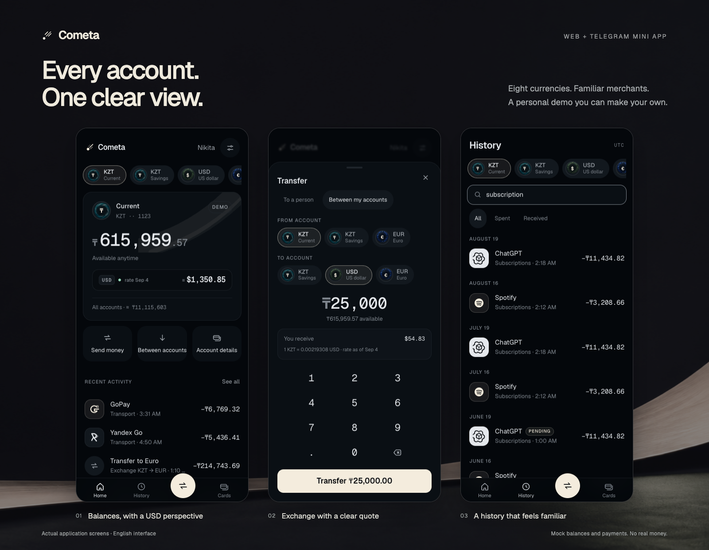
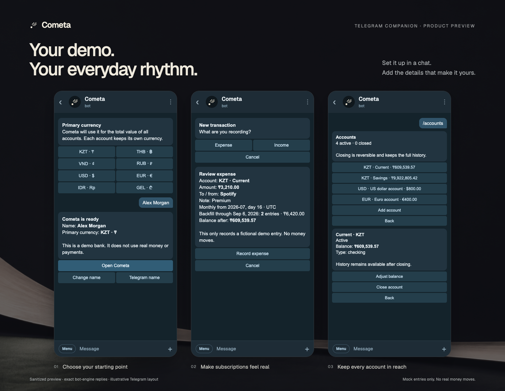

# Cometa

A personal banking sandbox for the web and Telegram.

[Open the demo](https://euphoria.bot) · [Meet the bot](https://t.me/MyBankApp_Bot)



Realistic merchants. Useful money flows. No real money.

## Make it yours

- **Eight currencies:** KZT, THB, VND, RUB, USD, EUR, IDR and GEL, with locally familiar merchants and comparable starting wealth in USD.
- **Four starting accounts:** spending, savings and two companion currencies. Add more, adjust a balance, or close and restore an empty account.
- **A clear money view:** account-level USD equivalents, portfolio totals, daily reference rates and an offline fallback.
- **Functional mock banking:** own-account FX, contact transfers, searchable history, savings interest and card freeze controls.
- **Russian or English:** a complete interface in either language.

Your onboarding currency chooses the initial demo. Changing the display currency later leaves your accounts and history intact.

## A bank, one chat away



<sub>Illustrative Telegram layout with exact replies captured from the bot engine. These are product previews, not production Telegram screenshots.</sub>

The release candidate adds three chat flows, pending production activation:

- `/add` records an expense or income: account, merchant or sender, note, amount and UTC date.
- Monthly entries can start in a past month. Preview the backfill before confirming; `/recurring` keeps the schedule manageable.
- `/accounts` adds accounts, adjusts balances, and reversibly closes or restores them.

Expenses and recurring entries use checking accounts. Savings corrections settle interest first.
No operation can push a mock account below zero. Confirmations are retry-safe.

The Mini App shares the same ledger with the bot once server authority is enabled. Each signed
Telegram profile has its own history; the first imported device snapshot becomes canonical.
A different existing device copy is never replaced silently. The standalone web demo stays local.

## Built to stay consistent

Balances come from an append-only ledger, not a second mutable balance field. Money uses integer
minor units. FX transfers retain the rate used at confirmation. Server revisions and idempotent
commands protect concurrent updates and retries; Web Locks serialize local browser tabs.

React 19 · TypeScript 6 · Vite · Tailwind CSS v4 · Zustand · Radix Dialog ·
`@tma.js/sdk-react` · Node.js 22 · SQLite · Vitest

## Demo, deliberately

No payment rails, bank connections, KYC or financial services.

The KZT fixture contains 437 deterministic transactions after initial interest settlement. It
includes a sanitized personal statement: names, account and card details, statement identifiers
and booking references were removed. Exact dates, merchants and amounts remain fingerprintable.
This is a deliberately disclosed public dataset, **not anonymous data**. The other seven currency
fixtures are fully synthetic.

SQLite and release-time backups currently share one VPS. Full loss of that server can lose Telegram
demo changes. Encrypted offsite backup and a tested disaster-recovery procedure are still planned.

## Run locally

Node.js 22 and pnpm 11 are required.

```bash
pnpm install --frozen-lockfile
pnpm dev
pnpm verify
```

[Bot setup](deploy/bot/README.md) · [VPS deployment](deploy/standalone/README.md) ·
[Project handoff](docs/handoff.md)

## Release status

The web demo and bot are live. Real Telegram Web onboarding and embedded Mini App launch pass
on the current release. The recovery build passes 815 automated tests and Linux CI; existing
demo histories remain intact.

The expanded Telegram ledger remains a release candidate. Signed real-backend, foreground-recovery
and first-import browser scenarios pass, but server activation and real two-profile Telegram
acceptance are still pending. Browser emulation does not establish Android or iOS WebView acceptance.
