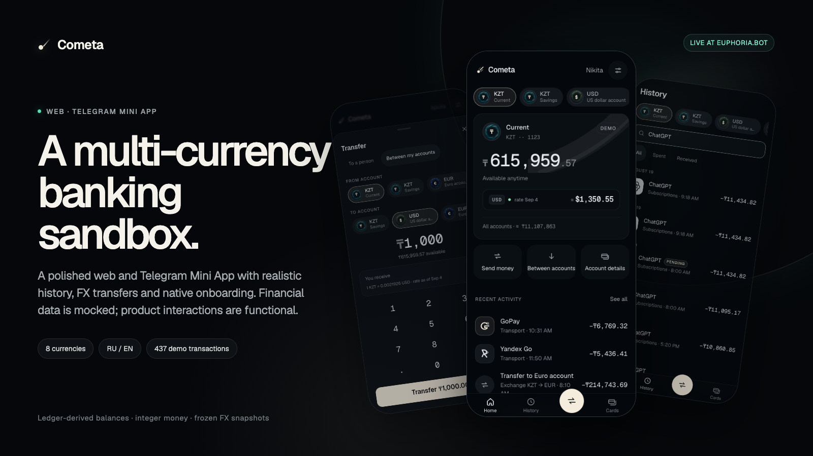
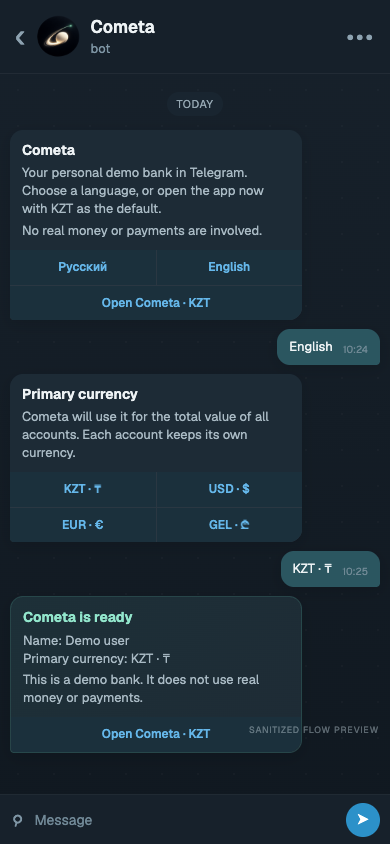
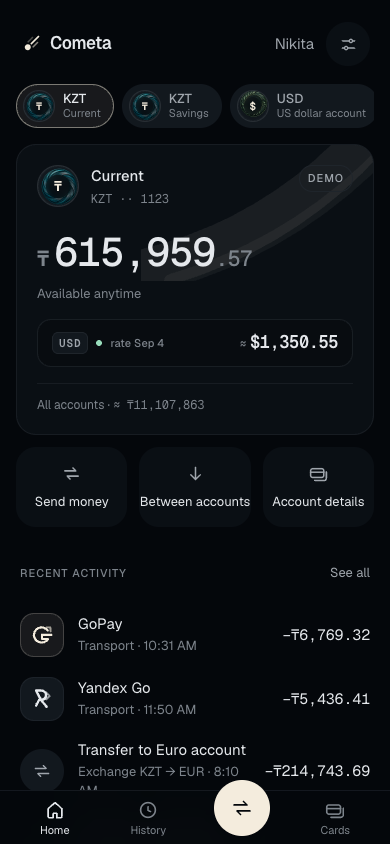
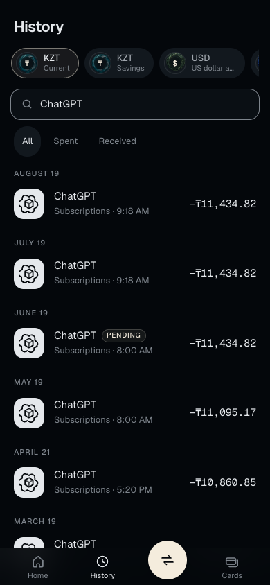
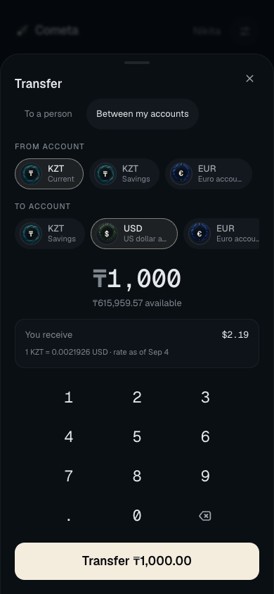
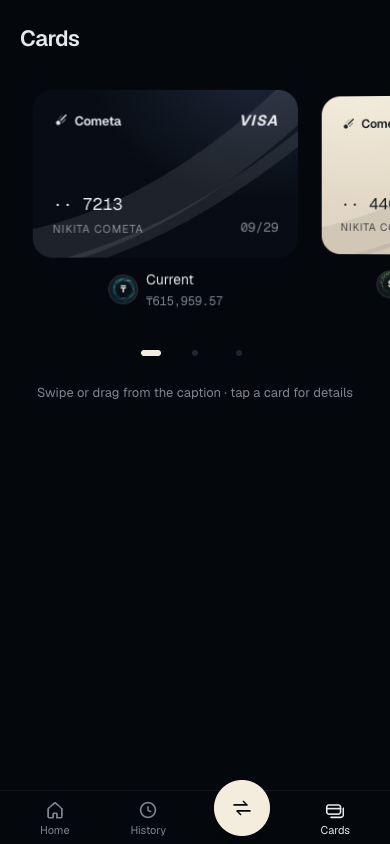
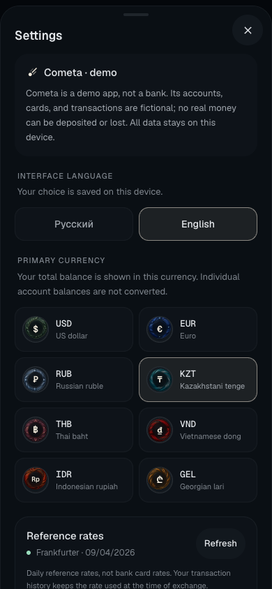

# Cometa

A personal multi-currency banking sandbox for the web and Telegram.

[Live demo](https://euphoria.bot) · [Telegram bot](https://t.me/MyBankApp_Bot)

<p align="center">
  
</p>

Cometa explores how a small personal finance product can feel calm, fast, and useful. It combines
realistic data, functional money flows, and a Telegram-native launch experience without connecting
to a bank or moving real money.

## Inside the demo

- Four accounts: KZT spending, KZT savings, USD, and EUR
- Portfolio totals in KZT, THB, VND, RUB, USD, EUR, IDR, or GEL
- A dedicated USD equivalent for every active non-USD account
- Daily reference rates with a deterministic offline fallback
- Own-account FX transfers with an immutable rate snapshot
- Simulated contact transfers with retry-safe submission
- Searchable history, pending operations, and custom merchant artwork
- Mock Visa and Mastercard cards with freeze controls
- Calendar-based savings interest recorded directly in the ledger
- A complete Russian and English interface

## Telegram Mini App

The companion bot guides each user through language, primary currency, and optional display-name
setup before opening Cometa.

Telegram launch data is verified by the backend. Preferences are bootstrapped into the Mini App,
while accounts, balances, cards, and transaction history stay on the device and remain isolated per
Telegram account. Native Main Button, Back Button, viewport, theme, and haptic behavior live behind
the same platform contract used by the web app.

<p align="center">
  
</p>

<p align="center"><sub>Sanitized reconstruction using the bot's current production copy. No personal Telegram profile data is shown.</sub></p>

## Product screens

<p align="center">
  <a href="docs/assets/showcase/home.png"></a>
  &nbsp;
  <a href="docs/assets/showcase/history.png"></a>
  &nbsp;
  <a href="docs/assets/showcase/transfer.png"></a>
</p>

<p align="center">
  <a href="docs/assets/showcase/cards.png"></a>
  &nbsp;&nbsp;
  <a href="docs/assets/showcase/settings.png"></a>
</p>

## Under the surface

```text
React application
├── domain       integer money, ledger, FX, interest, transfers
├── store        Zustand state and cross-tab-safe persistence
├── platform     interchangeable web and Telegram adapters
├── interface    mobile-first screens, sheets, and custom visuals
└── bot          Node.js, SQLite, onboarding, signed bootstrap
```

Balances are derived from the transaction ledger instead of stored twice. Money uses integer minor
units, completed FX transfers retain their exact rate snapshot, and client transfer IDs make retries
idempotent. Web Locks serialize cross-tab mutations before persistence.

The browser and Telegram environments meet through a narrow platform seam. The bot database stores
identity and interface preferences, never the mock banking ledger.

Vite · React 19 · TypeScript 6 · Tailwind CSS v4 · Zustand · Radix Dialog · `@tma.js/sdk-react` ·
Node.js 22 · SQLite · Vitest

## Data boundary

Cometa is an interactive mock. It has no real money, payment rails, bank connections, KYC, or
financial services.

The client ships with 437 deterministic demo transactions. Part of the fixture comes from a
sanitized personal statement: names, account details, card details, statement identifiers, and
booking references were removed, while exact dates, merchants, and amounts remain fingerprintable.
Keep this repository private unless that fixture is replaced with a shifted or synthetic dataset.

## Run locally

Requires Node.js 22 and pnpm 11.

```bash
pnpm install --frozen-lockfile
pnpm dev
pnpm verify
```

Bot and VPS setup use separate secret-safe runbooks:

- [`deploy/bot/README.md`](deploy/bot/README.md)
- [`deploy/standalone/README.md`](deploy/standalone/README.md)

## Status

The web experience and signed Telegram Desktop WebView flow are verified. Acceptance in current
Telegram clients on iOS and Android remains open.
